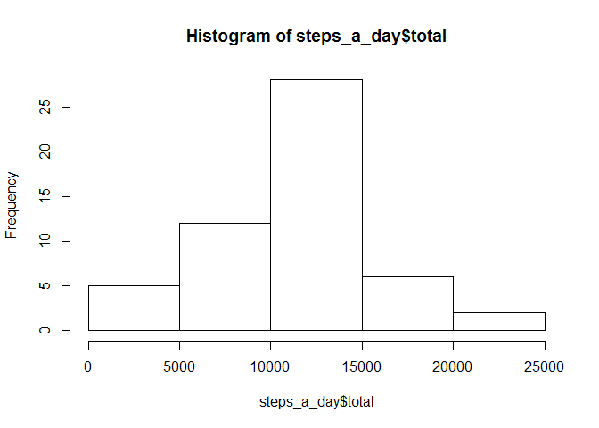
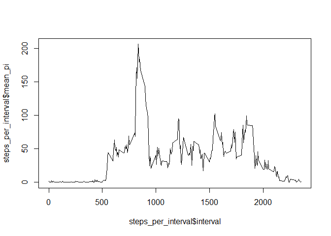
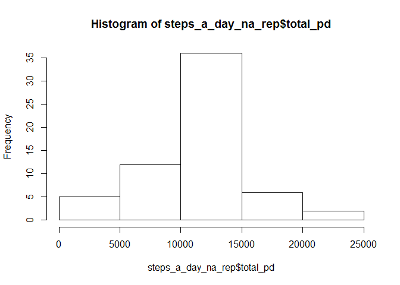
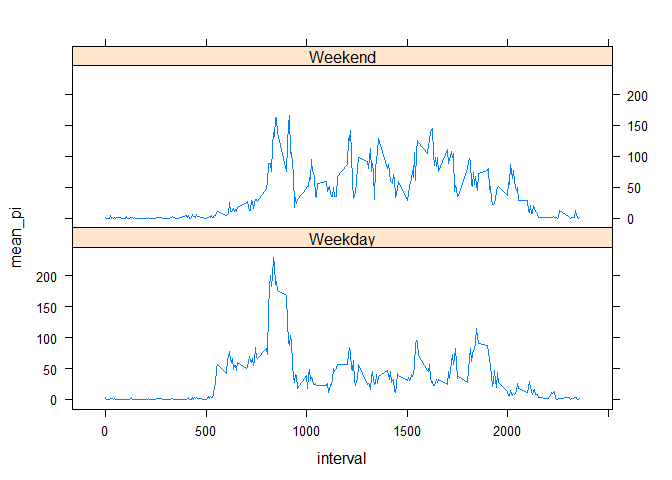

# Reproducible Research: Peer Assessment 1

This is an R Markdown document representing the Peer Assessment 1 of the Reproductible Research Course on Coursera.

Before to start the analysis, it loads the packages needed to perform the task. The code uses plyr package to join two data frames mantaining the original order, but there are some incompatibilities between plyr and dplyr packages, so the plyr package is loaded just to perform the join and then is unloaded.

Load lattice and dplyr package:

```r
##install.packages("lattice")
library(lattice)

##install.packages("dplyr")
library(dplyr)
```

```
## 
## Attaching package: 'dplyr'
## 
## The following objects are masked from 'package:stats':
## 
##     filter, lag
## 
## The following objects are masked from 'package:base':
## 
##     intersect, setdiff, setequal, union
```

## Loading and preprocessing the data

First we need to set the apropriated working directory:

```r
setwd("C:/Users/labbe-pc/RepData_PeerAssessment1")
```

And then, load the csv file into a data frame:

```r
  activity <- read.csv("activity.csv")
```

## Process/transform the data (if necessary) into a format suitable for your analysis
As the original data frame has missing values, we need to identify and, at first, ignore them:

```r
  missing_values <- is.na(activity$steps)
  clean_activity <- activity[!missing_values,]
```

## What is mean total number of steps taken per day?
To calculate the total steps per day, first we need to agregate by date

```r
  ## Agregate by date
  by_day <- group_by(clean_activity, date)

  ## Summarise by date
  steps_a_day <- summarise(by_day, total_pd = sum(steps), mean_pd = mean(steps), median_pd = median(steps) )

    ## Change the type of date
  steps_a_day <- mutate(steps_a_day, date = as.Date(as.character(steps_a_day$date)))
```

The distribution of the steps is shown in this histogram:

```r
  ## Distribution of steps a day
  hist(steps_a_day$total)
```

 

The median is:

```r
  ## Median of total steps per day
  median(steps_a_day$total)
```

```
## [1] 10765
```

And the mean is:

```r
  ## Mean of total steps per day
  mean(steps_a_day$total)
```

```
## [1] 10766.19
```

## What is the average daily activity pattern?
To discover the daily activity pattern, first we need to agregate the data by interval. Then calculate the mean and plot:

```r
  ## Agregate by interval
  by_interval <- group_by(clean_activity, interval)
  
  ## Summarise by interval
  steps_per_interval <- summarise(by_interval, mean_pi = mean(steps) )
  
  ## Plot the activity patern of each interval
  plot(steps_per_interval$interval, steps_per_interval$mean_pi, type = "l" )
```

 

To answer which 5-minute interval, on average across all the days in the dataset, contains the maximum number of steps, we need to execute this code:

```r
  ## Sort by interval to discover the interval with more steps
  head( steps_per_interval[order(-steps_per_interval$mean_pi),], 1 )
```

```
## Source: local data frame [1 x 2]
## 
##   interval  mean_pi
##      (int)    (dbl)
## 1      835 206.1698
```

## Imputing missing values
I used the same logical vector that contains the missing values used above to calculate the number of missing values (NA):

```r
  ## NUmber of missing values
  sum(missing_values)
```

```
## [1] 2304
```

To replace the missing values (NA), I decided to use the interval mean across all days. As I already had computaded this values, I just need to join by the interval to merge both data sets (the orignal and the agregated). As mentioned before, I load the plyr package just to perform this operation, and then detached the package.

I used plyr because the join function preserves the original order of the first data frame.

Once I have the steps and the mean by interval in the same data frame, the update need subset just the missing values, using the logical vector again.

```r
  ## Load plyr package
  ## install.packages("plyr")
  library(plyr)  
```

```
## -------------------------------------------------------------------------
## You have loaded plyr after dplyr - this is likely to cause problems.
## If you need functions from both plyr and dplyr, please load plyr first, then dplyr:
## library(plyr); library(dplyr)
## -------------------------------------------------------------------------
## 
## Attaching package: 'plyr'
## 
## The following objects are masked from 'package:dplyr':
## 
##     arrange, count, desc, failwith, id, mutate, rename, summarise,
##     summarize
```

```r
  ## Create a new dataframe to recover the mean for each interval
  activity_na_rep <- join(activity, steps_per_interval, by = "interval")

  ## remove plyr package
  detach("package:plyr", unload=TRUE)  

  ## Replace the NA values for the interval's mean
  activity_na_rep$steps[missing_values] <- activity_na_rep$mean_pi[missing_values]
```

Preparing the data frame with filled averages by interval insted of NA's to see how they changed the previous analysis:

```r
  ## Change the type of date
  activity_na_rep <- mutate(activity_na_rep, date = as.Date(as.character(activity_na_rep$date)))
  
  ## Agregate by date
  by_day_na_rep <- group_by(activity_na_rep, date)
  
  ## Summarise by date
  steps_a_day_na_rep <- summarise(by_day_na_rep, total_pd = sum(steps), mean_pd = mean(steps), median_pd = median(steps) )
```

Plots the distribuition by interval in the histogram:

```r
## Make a histogram of the total number of steps taken each day and Calculate and report the mean and median total number of steps taken per day. Do these values differ from the estimates from the first part of the assignment? What is the impact of imputing missing data on the estimates of the total daily number of steps?
  ## Distribution of steps a day
  hist(steps_a_day_na_rep$total_pd)
```

 

The median is:

```r
  ## Median of total steps per day
  median(steps_a_day_na_rep$total_pd)
```

```
## [1] 10766.19
```

And the mean is:  

```r
  ## Mean of total steps per day
  mean(steps_a_day_na_rep$total_pd)
```

```
## [1] 10766.19
```

## Are there differences in activity patterns between weekdays and weekends?
Create a new factor variable in the dataset with two levels - "weekday" and "weekend" indicating whether a given date is a weekday or weekend day.

```r
  steps_a_day_na_rep <- mutate(activity_na_rep, wd = factor(ifelse( weekdays(activity_na_rep$date) %in% c ( "sábado" , "domingo"), "Weekend", "Weekday" )) )
```

Prepare the data to plot:

```r
## Make a panel plot containing a time series plot (i.e. type = "l") of the 5-minute interval (x-axis) and the average number of steps taken, averaged across all weekday days or weekend days (y-axis). See the README file in the GitHub repository to see an example of what this plot should look like using simulated data.
  ## Agregate by interval
  by_interval_wd <- group_by(steps_a_day_na_rep, wd, interval)
  
  ## Summarise by interval
  steps_per_interval_wd <- summarise(by_interval_wd, mean_pi = mean(steps) )
```

Plot both levels of the factor to compare weekday's to wekend's daily patterns.

```r
  ## Plot the activity patern of each interval for weekdays and weekends
  xyplot(mean_pi~interval|wd, steps_per_interval_wd, type = "l", layout=(c(1,2) ) )
```

 
